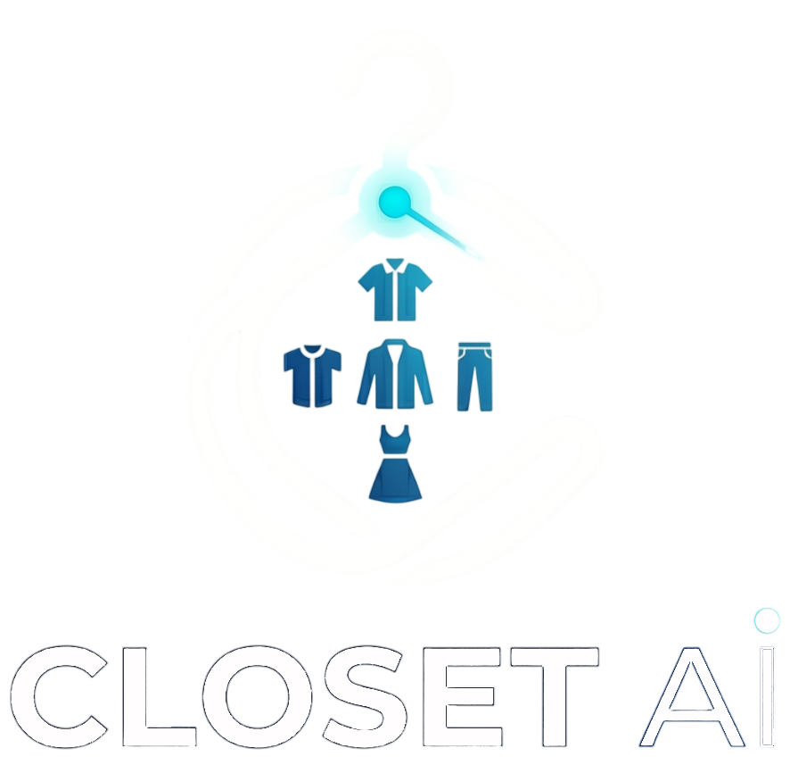

<div align="center">



# ClosetAI

**Your Personal AI Stylist & Digital Wardrobe Manager**

<p align="center">
  <a href="https://flutter.dev/"></a>
  <a href="https://firebase.google.com/"></a>
  <a href="https://deepmind.google/technologies/gemini/"></a>
  <a href="LICENSE"></a>
</p>

<p align="center">
  <i>Organize your closet, track laundry, and get daily outfit inspiration powered by advanced Generative AI.</i>
</p>

</div>

---

## Table of Contents

1. [About the Project](#about-the-project)
2. [Visuals & UI](#visuals--ui)
3. [Key Features](#key-features)
4. [Tech Stack](#tech-stack)
5. [System Architecture](#system-architecture)
6. [Getting Started](#getting-started)
7. [Project Structure](#project-structure)
8. [Design System](#design-system)
9. [Roadmap](#roadmap)
10. [Contact & Developer](#contact--developer)

---

## About the Project

**ClosetAI** bridges the gap between fashion and technology. Have you ever stared at a full closet and felt like you had nothing to wear? ClosetAI solves this by digitizing your wardrobe.

By utilizing Google's Gemini 2.5 Flash vision capabilities, the app automatically tags and categorizes your clothes from a single photo. It then acts as a context-aware personal stylist, recommending outfits based *only* on the items that are currently clean and available in your digital closet.

---

## Visuals & UI

<div align="center">
  &nbsp;
  
  &nbsp;
  &nbsp;
</div>

---

## Key Features

-  **AI Auto-Tagging:** Upload or snap a photo of a garment. ClosetAI instantly analyzes the image to extract its `Name`, `Category`, `Type`, and `Dominant Color` — outputting perfectly structured JSON.
-  **Conversational Stylist:** A built-in chatbot that acts as your personal fashion assistant. It reads your active inventory and curates outfits tailored to your requests.
-  **Smart Laundry Tracking:** Never get recommended a shirt that's in the wash. Easily toggle items between `Available` and `Laundry`.
-  **Secure & Synced:** Powered by Firebase Auth (Google Sign-In) and Firestore. Your digital closet syncs seamlessly across all your devices.
-  **Optimized Storage:** Images are compressed on-device using `flutter_image_compress` before being uploaded to Firebase Storage/Cloudinary, saving bandwidth and load times.

---

## Tech Stack

### Frontend

- **Framework:** [Flutter](https://flutter.dev/) (SDK ^3.11.0)
- **Language:** Dart
- **UI/UX:** Custom Dark Theme implementation (`Material 3`)

### Backend & Cloud

- **Database:** Cloud Firestore
- **Authentication:** Firebase Auth (Google Sign-In integration)
- **Storage:** Firebase Storage & Cloudinary (`cloudinary_public`)

### AI & Integrations

- **Generative AI:** `google_generative_ai` (Gemini 2.5 Flash Model)
- **Environment Management:** `flutter_dotenv`

---

## System Architecture

### 1. Image Analysis Pipeline

1. User captures an image (`image_picker`).
2. Image is resized and compressed (`flutter_image_compress`).
3. Sent to **Gemini 2.5 Flash** with a strict prompt forcing a JSON response.
4. Parsed locally into a `ClothingAnalysis` Dart model.
5. Saved to **Firestore**.

### 2. Context-Aware Styling

1. The app queries Firestore for all items where `status != 'laundry'`.
2. The clean inventory is serialized into JSON.
3. Passed to the Gemini Chat Session as `SystemInstructions`.
4. The AI returns contextual fashion advice restricted strictly to the user's available wardrobe.

---

## Getting Started

Follow these instructions to set up the project locally.

### Prerequisites

- Flutter SDK (`>= 3.11.0`)
- A Firebase Project configured for Android/iOS
- A Cloudinary Account (for image hosting)
- Google Gemini API Key

### Installation

1. **Clone the repo**

```bash
git clone https://github.com/arhaanjan/ClosetAI.git
cd closet_ai
```

2. **Install dependencies**

```bash
flutter pub get
```

3. **Environment Setup** — create a `.env` file in the root:

```env
GEMINI_API_KEY=your_secure_api_key_here
CLOUDINARY_CLOUD_NAME=your_cloud_name
CLOUDINARY_UPLOAD_PRESET=your_preset
```

4. **Initialize Firebase**

```bash
flutterfire configure
```

5. **Run the app**

```bash
flutter run
```

---

## Project Structure

```text
lib/
├── models/
│   └── clothing_item.dart          # Data classes
├── screens/
│   ├── auth/                       # Login, Signup, Forgot Password
│   ├── home_screen.dart            # Main dashboard & inventory
│   ├── add_item_screen.dart        # Camera & AI auto-tagging UI
│   ├── fashion_assistant_screen.dart  # Gemini chatbot UI
│   └── profile_screen.dart         # User settings
├── services/
│   ├── firebase_service.dart       # Auth & Firestore logic
│   └── gemini_service.dart         # AI integration & JSON parsing
├── main.dart                       # App entry point & routing
└── firebase_options.dart           # Auto-generated Firebase config
```

---

## Design System

ClosetAI uses a sleek, distraction-free dark mode layout designed to make your clothing pop.

| Element | Color Hex |
| :--- | :--- |
| **Background** | `#0A0A0F` |
| **Surface/Card** | `#1C1C27` |
| **Primary Accent** | `#7C6EF0` |
| **Available Tag** | `#4ADE80` |
| **Laundry Tag** | `#E8934A` |

---

## Roadmap

- [x] MVP Initialization
- [x] User Authentication & Security
- [x] Gemini Vision Auto-Tagging
- [x] Laundry Status Toggle
- [ ] Background remover on upload
- [ ] Weather API Integration (suggest outfits based on local weather)
- [ ] Save outfits and outfits tab
- [ ] Detailed stats on everything you own

---

## License

Distributed under the MIT License. See `LICENSE` for more information.

---

## Contact & Developer

**Arhaan Jan** — App Developer & Designer

- **GitHub:** [@arhaanjan](https://github.com/arhaanjan)
- **LinkedIn:** [Arhaan Jan](https://linkedin.com/in/arhaanjan)
- **Project Link:** [https://github.com/arhaanjan/ClosetAI](https://github.com/arhaanjan/ClosetAI)

<p align="center">
  <i>Built using Flutter.</i>
</p>
